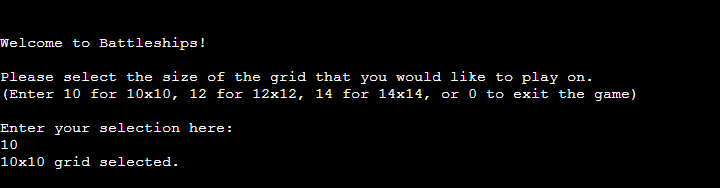
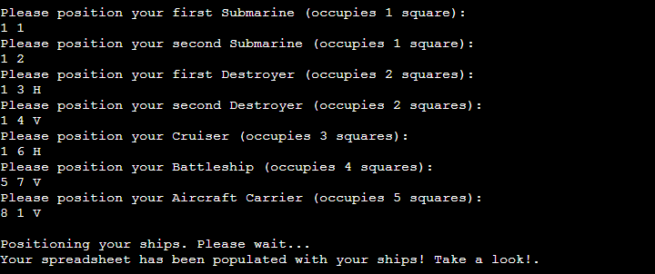
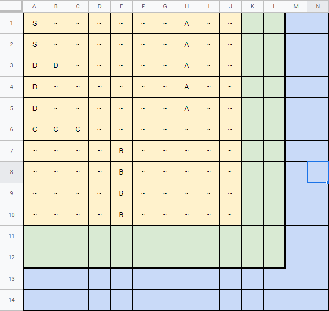
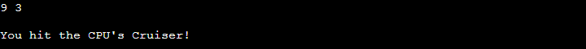
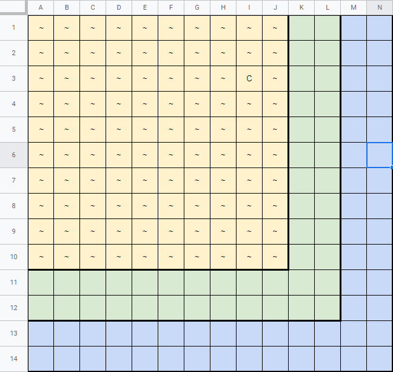
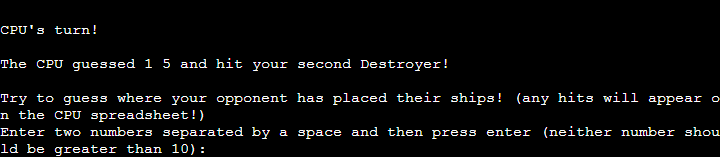
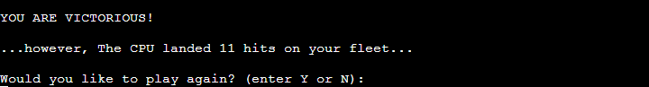
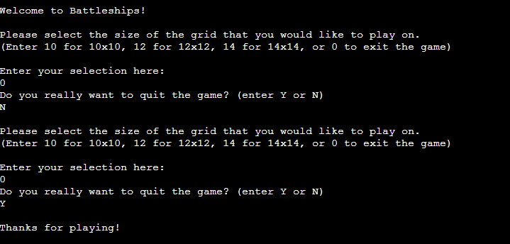

# Battleships

This is a command-line based version of the popular board game <em>Battleships</em>.

Played entirely within a command terminal, this version of the game is completely text-based. The user must position each of their ships by providing number coordinates,
and then, also by entering number coordinates, they must guess where the CPU has placed its own ships.

While playing, it is also possible to monitor the state of the game from within a spreadsheet. This spreadsheet tracks, in real-time, the hits dealt to the CPU, and the hits received by the player.

It is intended to be a fun, simple diversion that is lightly strategic, much like Solitaire, or Minesweeper.

## Technologies used
<ul>
    <li>Python</li>
    <li>GitHub</li>
    <li>GitPod</li>
    <li>Git</li>
    <li>Google Cloud Platform</li>
    <li>Heroku</li>
    <li>Markdown</li>
    
</ul>

## Features

### Existing Features

### Grid size selection

At the game's outset, the player is given a choice of three square grid sizes - 10x10, 12x12, and 14x14. In the interest of simplicity, I chose not to add any more options beyond these three, not to mention that trying to find ships in a grid bigger than 14x14 would be very tedious. The player's input is validated so that any attempts to enter other sizes will
be prevented.

### Ship positioning

Once the player has chosen a grid size, they must position each of their ships. Again, to keep things simple, and because the ships in <em>Battleships</em> are traditionally of fixed size and shape, the player is only asked to provide a single pair of x and y coordinates. These coordinates serve as the origin point of each ship.

With the exception of the Submarines (which only occupy a single square on the grid), the player must provided one of two letters to specify a ship's orientation on the grid. In <em>Battleships</em>, ships can either be vertical (parallel to the y axis), or horizontal (parallel to the x axis), so the player must provide either the letter H or the letter V in addition to their coordinates of choice. Vertically-placed ships extend downwards from the origin coordinates, and horizontally-placed ships extend to the right.

Unlike the physical <em>Battleships</em>, I have added the ability to place ships diagonally as well. The player can add the letters DR or DL to place a ship diagonally right, or diagonally left. Like the vertical orientation, both diagonal orientations extend downwards. There is not a upwards diagonal option, currently.

Generally speaking, all of the above is designed so that simple input generates a fully playable game in a split second.

### CPU battle

After the player has made their choices, The 'player' sheet in said spreadsheet is fully populated with the player's ships according to how they chose to place them at the beginning (The CPU does the same, but their spreadsheet is not populated, for obvious reasons). 

Then, the game itself begins. During this phase, the player is prompted to enter 2 numbers to serve as coordinates on the CPU's grid. If the player lands a hit on one of the CPU's ships, the first letter of that ship's name appears on the 'cpu' sheet of a spreadsheet linked to the game. This way, the player can get a sense of where next to target at a glance.

Each ship is represented by an initial letter (e.g. 'S' for submarine), and if the CPU lands a hit, the corresponding letter will be changed to an 'X'.

The game phase respects the player's time - it immediately and quickly responds to the player's input.

### Play again / Exit game

Once a victor has been declared, the player is given the option to play again. If they choose not to, the game will close.

Also, at the beginning of the game, there is an opportunity for the player to quit. They can do this by entering 0 instead of 10, 12, or 14.

### Features yet to be implemented

### 2 player mode

If I were able to write network code, I would like to add a 2-player mode to the program. It would be selectable from a menu at the beginning, and would again use the spreadsheets. However, each player would have a different copy or instance of the spreadsheet to prevent them from seeing the positions of one another's ships. Other than this, the spreadsheets would behave in the same way as in the CPU mode - with hits dealt to the opponent gradually populating the 'opponent' spreadsheet, and hits dealt to the player inserting Xs into the 'player spreadsheet.

### CPU AI / harder difficulty modes

I would like to implement basic AI for the CPU at some point. What I had in mind was for the CPU, if it lands a hit, to randomly target one of the 4 squares adjacent to the one it hit. If it missed despite this, it would return to picking random squares all over the board.

I thought that rather than make this the default behaviour of the CPU, I could make it a feature of a "hard mode" that the player could select at the beginning.

An even harder mode is also possible - one in which, if the CPU hits the second square of a ship whose length is 3 squares or more, it will move to the next square, rather than randomly choosing from the other 2 adjacent squares. A harder mode still could omit the names of the ships hit by the player.

I also considered a nightmare mode in which the CPU's ships move after 2-3 rounds.

### Hint system for bigger grids

Since the 14x14 grid games can take a bit longer than I would like, I would like to add the option to turn on hints for them. What I had in mind was to have a message appear every couple of turns giving a non-specific location for a non-specific ship. The message would read something like, "You hear a loud machine noise in the vicinity of 1,1 to 4,4...".

### GUI / sound effects

While it is possible to create a sense of tension and excitement with text, it is easier to do this audiovisually. Moreover, terminal interfaces are very uninteresting to look at. The game is supposed to be fun and simple, and I think a nice GUI with graphics for the grid and the ships would increase the fun factor, and it needn't decrease the simplicity. In fact, sound and audio could make the game even more intuitive.

### More orientations

I would like to add left horizontal, up vertical, and up left and up right diagonal. I think this could possibly make the positioning a bit more intuitive. The player could do more from a single square, e.g. a cruiser at G5 could be oriented diagonally up and right to I3, not just diagonally down and left to E7. When diagonally down and left is the only option, the player has to place the cruiser on I3 to achieve the desired orientation. 

On the other hand, the amount of shorthand that the player would have to learn would double. Rather than just H, V, DR, and DL, there would be HR, HL, VU, VD, DRU, DRD, DLU, and DLD. So, this might cancel out the added intuitiveness. 

## Testing

<em>Please refer to TEST.md.</em>

## Deployment

The process followed in order to deploy this project to Heroku was as follows:
<ol>
    <li>Through the Google Cloud Platform, I created a new project.</li>
    <li>To this project, I added the Google Drive API, making sure to create credentials when enabling it.</li>
    <li>To the service account that was created as a result of the above, I added a key, selecting JSON. This saved a .json file to my PC.</li>
    <li>I added the Google Sheets API.</li>
    <li>Next, I navigated to GitPod and added the .json file from step 3 to my repository. I renamed this file to creds.json, and added it to .gitignore.</li>
    <li>Inside creds.json, I copied the value after 'client_email' and then navigated to the Google Sheet I created for this project, clicked Share, and pasted in said value, making sure to select 'Editor'.</li>
    <li>The next step was to install two dependencies in my GitPod workspace for the project: gspread, and google-auth. I achieved this using the terminal command "pip3 install gspread google-auth". I also added several lines of code to run.py in order for it access these dependencies.</li>
    <li>Once I had completed some work on the project, I deployed it to Heroku. The first step for this deployment was to compile a requirements.txt file. I did this by using the temrinal command 'pip3 freeze > requirements.txt'. This added the project dependencies to said .txt file.</li>
    <li>I logged into my Heroku account, and created a new app, setting its region to Europe.</li>
    <li>In the settings menu, I navigated to Config Vars, and created a new key. I gave the key the name "CREDS", and for its value, I pasted in the entire contents of creds.json. Then, I clicked Add.</li>
    <li>While still in Config Vars, I added one more key. This one was called "PORT", and its value was 8800.</li>
    <li>Next, while still in the Settings menu, I scrolled down to Buildpacks. Here, I installed both Python and node.js, making sure that Python was at the top of the list.</li>
    <li>Finally, in the Deploy section, I selected GitHub, and then searched for the repository for this project. When I found it, I clicked Connect, and then Deploy Branch (manual deploy).</li>
</ol>
 
 Live links to this project: 
- Program: https://battleships-ci-2022-23.herokuapp.com/
- Spreadsheet: https://docs.google.com/spreadsheets/d/1Vrt-P9ZnOsd72kd0d1Suqn6pB__ju0vFz6W6xhLOst8/edit?usp=sharing

## Credits

gspread (a Python API for Google Sheets): https://docs.gspread.org/en/v5.6.1/
